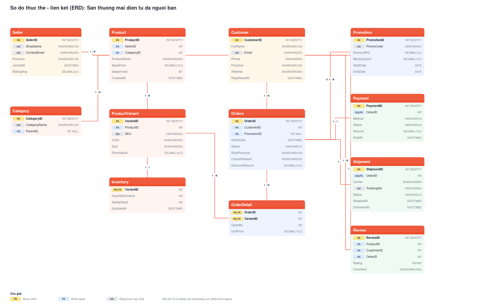

# Chương 2 — Thiết kế và quản trị CSDL quan hệ

## 2.1. Mô hình thực thể liên kết (ERD)

Lược đồ gồm **12 thực thể**, chia làm bốn nhóm nghiệp vụ:

| Nhóm | Thực thể | Vai trò |
|---|---|---|
| Người dùng | `Customer`, `Seller` | Hai phía của sàn giao dịch |
| Danh mục | `Category`, `Product`, `ProductVariant`, `Inventory` | Cây danh mục và hàng hóa |
| Giao dịch | `Orders`, `OrderDetail`, `Promotion` | Đơn hàng và khuyến mãi |
| Hệ quả | `Payment`, `Shipment`, `Review` | Phát sinh sau khi có đơn |

## 2.2. Lược đồ quan hệ và chuẩn hóa

### Danh sách khóa

| Bảng | Khóa chính | Khóa ngoại | Ràng buộc duy nhất |
|---|---|---|---|
| Customer | CustomerID | — | Email |
| Seller | SellerID | — | ShopName, ContactEmail |
| Category | CategoryID | ParentID → Category | CategoryName |
| Product | ProductID | SellerID → Seller, CategoryID → Category | — |
| ProductVariant | VariantID | ProductID → Product | SKU, (ProductID, Color, Size) |
| Inventory | VariantID | VariantID → ProductVariant | — |
| Promotion | PromotionID | — | PromoCode |
| Orders | OrderID | CustomerID → Customer, PromotionID → Promotion | — |
| OrderDetail | (OrderID, VariantID) | OrderID → Orders, VariantID → ProductVariant | — |
| Payment | PaymentID | OrderID → Orders | OrderID |
| Shipment | ShipmentID | OrderID → Orders | OrderID, TrackingNo |
| Review | ReviewID | ProductID, CustomerID, OrderID | (OrderID, ProductID, CustomerID) |

### Quá trình chuẩn hóa

**Từ 1NF lên 2NF.** Thiết kế thô ban đầu gộp toàn bộ thông tin đơn hàng vào một
bảng `DonHang(OrderID, VariantID, TenKhach, DiaChi, TenSanPham, SoLuong, DonGia)`.
Khóa chính là `(OrderID, VariantID)`, nhưng `TenKhach` và `DiaChi` chỉ phụ thuộc
vào `OrderID` — tức **phụ thuộc bộ phận** vào khóa. Tách thành `Orders` (thông tin
cấp đơn) và `OrderDetail` (thông tin cấp dòng) để đạt 2NF.

**Từ 2NF lên 3NF.** Trong bảng `Product` thô có cả `CategoryName` và `SellerName`.
Hai cột này phụ thuộc vào `CategoryID` và `SellerID` chứ không phụ thuộc trực tiếp
vào `ProductID` — **phụ thuộc bắc cầu**. Tách ra thành `Category` và `Seller`.

**Một chỗ cố ý không chuẩn hóa.** Cột `OrderDetail.UnitPrice` trùng lặp với
`Product.BasePrice + ProductVariant.PriceAdjust` tại thời điểm đặt hàng. Đây **không
phải lỗi thiết kế** mà là *snapshot có chủ đích*: nếu chỉ tham chiếu giá hiện tại,
mọi hóa đơn cũ sẽ tự đổi giá mỗi khi người bán điều chỉnh giá sản phẩm — sai về mặt
kế toán. Tương tự, `Seller.RatingAvg` là giá trị tính sẵn được trigger cập nhật, đánh
đổi một chút dư thừa lấy tốc độ đọc.

## 2.3. Ràng buộc toàn vẹn và lựa chọn kiểu dữ liệu

### Kiểu dữ liệu

| Cột | Kiểu | Lý do |
|---|---|---|
| Tiền (`BasePrice`, `UnitPrice`, `Amount`) | `DECIMAL(18,2)` | **Tuyệt đối không dùng `FLOAT`** — số thực dấu chấm động không biểu diễn chính xác được `0.1`, cộng dồn hàng nghìn dòng sẽ lệch tiền. `DECIMAL` lưu chính xác theo cơ số 10. Phần nguyên 16 chữ số đủ cho đơn hàng tỷ đồng. |
| Tên, địa chỉ | `NVARCHAR` | SQL Server cần `NVARCHAR` (UTF-16) để lưu dấu tiếng Việt; `VARCHAR` sẽ mất dấu. |
| Email, SKU, mã vận đơn | `VARCHAR` | Chỉ chứa ASCII, dùng `VARCHAR` tiết kiệm một nửa dung lượng so với `NVARCHAR`. |
| Thời điểm | `DATETIME2(0)` | Chính xác tới giây, dải rộng hơn và chuẩn hơn `DATETIME` cũ. Không cần mili giây cho nghiệp vụ này. |
| `Rating` | `TINYINT` | Chỉ nhận 1–5, dùng 1 byte thay vì 4 byte của `INT`. |
| `IsApproved` | `BIT` | Giá trị luận lý. |
| `DiscountPct` | `DECIMAL(5,2)` | Phần trăm tối đa 100.00 — ba chữ số nguyên là thừa đủ. |
| Trạng thái | `VARCHAR` + `CHECK` | SQL Server không có kiểu `ENUM` như PostgreSQL. |

### Ràng buộc khai báo (declarative)

- **`CHECK`** — `Quantity > 0`, `UnitPrice > 0`, `Rating BETWEEN 1 AND 5`,
  `QuantityOnHand >= 0`, `EndDate >= StartDate`, `Status IN (...)`.
- **`CHECK` liên cột** — `Status <> 'Cancelled' OR CancelReason IS NOT NULL`
  (đơn hủy bắt buộc có lý do), `Status <> 'Paid' OR PaidAt IS NOT NULL`.
- **`UNIQUE`** — email khách, SKU, mã vận đơn; `(OrderID, ProductID, CustomerID)`
  trên `Review` để một khách chỉ đánh giá một sản phẩm một lần trong một đơn.
- **`FOREIGN KEY`** — `ON DELETE CASCADE` cho quan hệ sở hữu (xóa sản phẩm thì xóa
  biến thể và tồn kho); `NO ACTION` cho quan hệ lịch sử (không cho xóa khách hàng
  còn đơn hàng, không cho xóa danh mục còn sản phẩm).

### Ràng buộc bằng trigger

Bốn quy tắc dưới đây **không thể** diễn đạt bằng `CHECK` vì chúng cần truy vấn sang
bảng khác:

| Trigger | Quy tắc | Vì sao cần trigger |
|---|---|---|
| `TR_OrderDetail_TruTonKho` | Trừ tồn kho khi thêm dòng đơn; chặn nếu không đủ hàng | `CHECK` chỉ nhìn được dòng hiện tại, không đọc được bảng `Inventory` |
| `TR_Orders_HoanTonKho` | Hoàn tồn kho khi đơn chuyển sang `Cancelled`/`Returned` | Cần so sánh trạng thái cũ và mới |
| `TR_Review_KiemTra` | Chỉ khách đã nhận hàng mới được đánh giá | Cần kiểm tra tồn tại của đơn `Delivered` chứa sản phẩm đó |
| `TR_Review_CapNhatRating` | Cập nhật `Seller.RatingAvg` | Tính tổng hợp trên nhiều dòng |

Trigger trừ tồn kho dùng `SELECT ... FOR UPDATE` (PostgreSQL) để khóa dòng tồn kho,
tránh tình huống hai đơn cùng mua nốt sản phẩm cuối cùng.

## 2.4. Sinh dữ liệu giả lập

Script `seed_sql.py` dùng thư viện Faker (locale `vi_VN`), đặt hạt giống ngẫu nhiên
cố định để kết quả tái lập được. Dữ liệu được sinh có chủ đích phản ánh thực tế:

- Trạng thái đơn theo phân phối thực: 68% `Delivered`, 10% `Cancelled`, 3% `Returned`.
- Tốc độ giao hàng khác nhau theo hãng vận chuyển (GHN nhanh nhất, Ninja Van chậm nhất).
- Điểm đánh giá lệch về phía cao (5 sao 40%, 1 sao 5%) giống hành vi người dùng thật.
- Dòng đơn vượt tồn kho bị trigger chặn — **đây là bằng chứng ràng buộc hoạt động**,
  script ghi nhận và bỏ qua các dòng đó thay vì tắt trigger.

## 2.5. Mười truy vấn nghiệp vụ

Xem `sql/sqlserver/03_views_procedures.sql`. Mỗi yêu cầu YC01–YC10 ở Chương 1 tương
ứng một đối tượng CSDL: 8 `VIEW`, 1 `STORED PROCEDURE` (YC02, có tham số khoảng thời
gian và số lượng Top N), 1 `FUNCTION` trả bảng (YC10, có tham số ngưỡng lọc).
