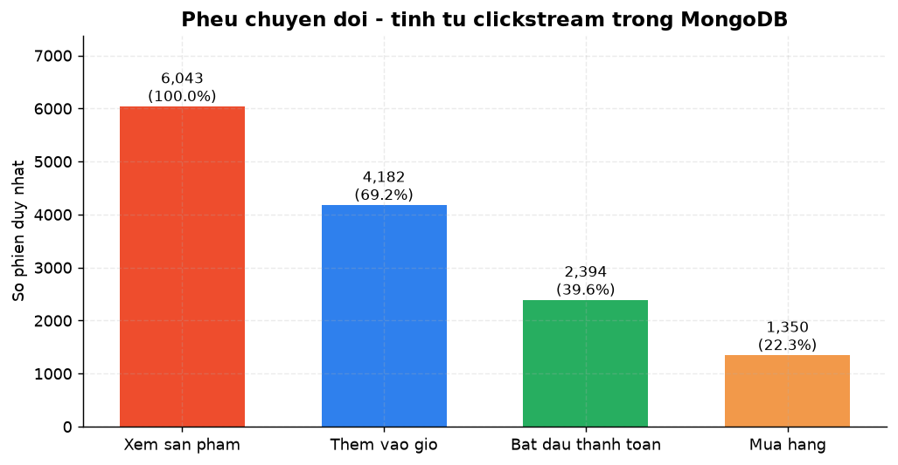
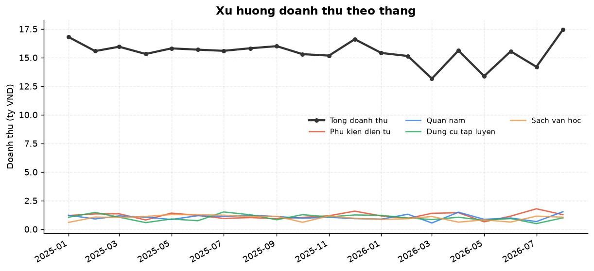
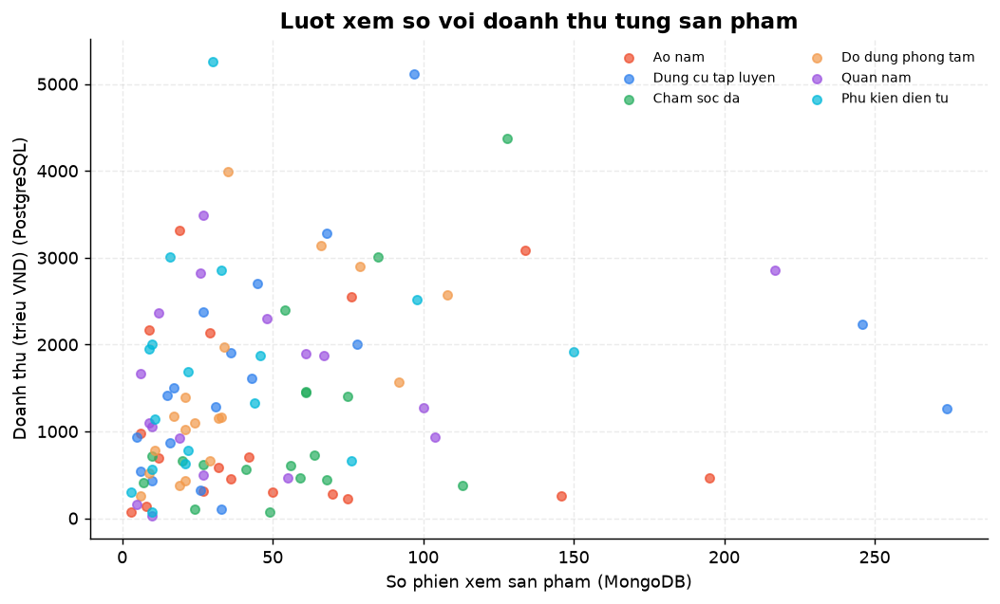
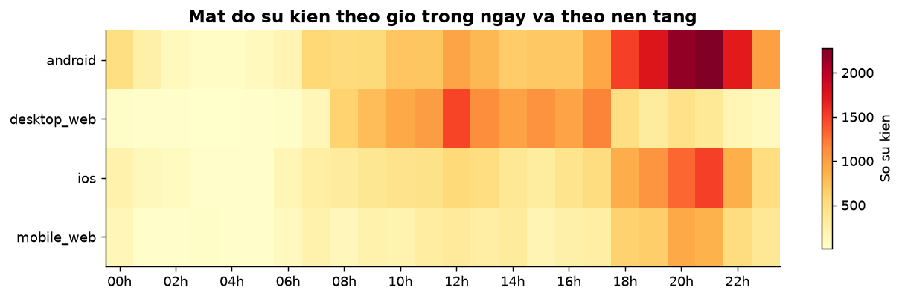
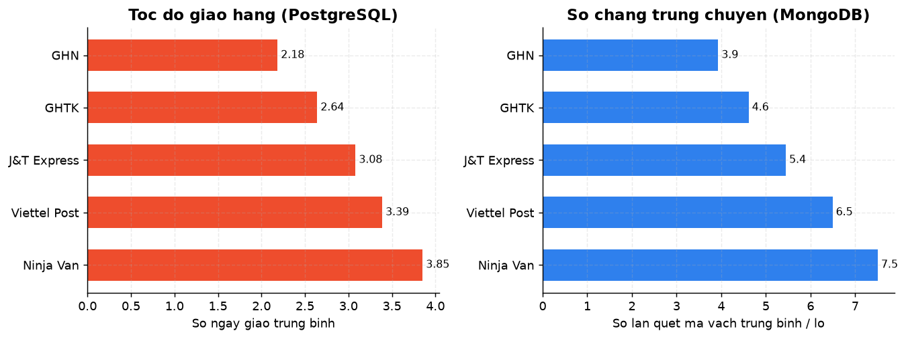
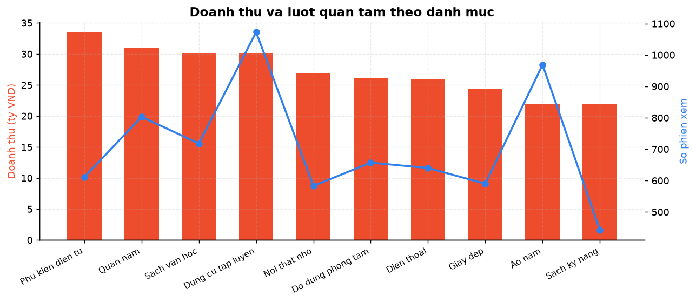

# Chương 4 — Phân tích dữ liệu lớn: biểu đồ và ý nghĩa nghiệp vụ

*Sinh tự động bởi `analytics.py` lúc 20/09/2026 09:15*

Mỗi biểu đồ dưới đây được dựng từ dữ liệu đã gộp giữa PostgreSQL (dữ liệu giao dịch) và MongoDB (dữ liệu hành vi).

## Pheu chuyen doi

**Ý nghĩa nghiệp vụ:** Tu luot xem san pham den luc mua hang, he thong mat 77.7% so phien. Hut lon nhat nam o buoc tu
'Them vao gio' (69.2%) xuong 'Bat dau thanh toan' (39.6%), goi y rang man hinh gio hang va chi
phi van chuyen la diem can toi uu truoc tien.

## Xu huong doanh thu theo thang

**Ý nghĩa nghiệp vụ:** Doanh thu dat dinh vao 08/2026 (17.4 ty) va thap nhat vao 03/2026 (13.2 ty). Bon danh muc dan
dau la Phu kien dien tu, Quan nam, Dung cu tap luyen, Sach van hoc; ke hoach nhap hang nen bam
theo nhip mua vu nay.

## Luot xem so voi doanh thu

**Ý nghĩa nghiệp vụ:** He so tuong quan giua luot xem va doanh thu chi dat 0.45, nghia la nhieu nguoi xem khong bao
dam ban duoc hang. Co 12 san pham nam trong nhom 25% duoc xem nhieu nhat nhung lai thuoc 35%
doanh thu thap nhat - day la nhom can ra soat lai gia ban, anh mo ta va chi phi van chuyen.
Phat hien nay chi co duoc khi gop du lieu hanh vi (MongoDB) voi du lieu giao dich (PostgreSQL).

## Mat do su kien theo gio

**Ý nghĩa nghiệp vụ:** Luu luong dat dinh luc 21h va thap nhat luc 03h. Nen tang chiem nhieu su kien nhat la android.
Khung gio cao diem nay quyet dinh thoi diem chay khuyen mai flash sale, dong thoi la can cu de
dat lich sao luu va bao tri he thong vao khung gio thap diem.

## Hieu suat don vi van chuyen

**Ý nghĩa nghiệp vụ:** GHN giao nhanh nhat (2.18 ngay), Ninja Van cham nhat (3.85 ngay) - chenh 1.67 ngay. So chang
trung chuyen di lien voi thoi gian giao (tuong quan 0.99): hang cang nhieu diem quet thi don
cang lau den tay khach, goi y nen rut bot chang cho cac tuyen noi thanh. Nen uu tien GHN cho
cac don gap.

## Doanh thu va luot quan tam theo danh muc

**Ý nghĩa nghiệp vụ:** Danh muc Phu kien dien tu dan dau doanh thu. Nguoc lai, Ao nam thu hut nhieu luot xem nhat tren
moi ty doanh thu - nhieu nguoi quan tam nhung gia tri don thap, phu hop de lam san pham keo
chan khach roi ban cheo sang danh muc gia tri cao hon.
